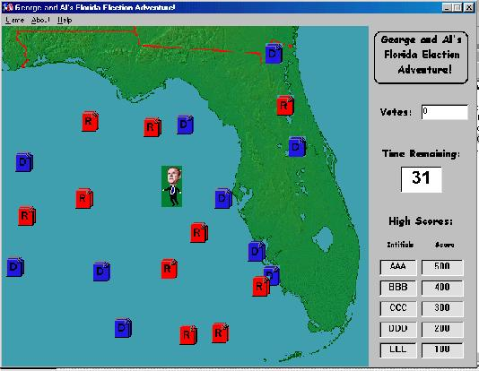



## Florida Adventure

### Description

This is just a simple game created as a class project. It 'stars' George Bush and Al Gore. The object is to grab as many ballots as you can within 45 seconds. It includes collision detection, high score list, music and sound effects. Code is pretty well documented, so other beginners can learn from it as well.
 
### More Info
 

             |
---                |---
**Submitted On**   |2000-12-14 07:47:34
**By**             |[Jeff Hutton](https://github.com/Planet-Source-Code/PSCIndex/blob/master/ByAuthor/jeff-hutton.md)
**Level**          |Beginner
**User Rating**    |4.8 (29 globes from 6 users)
**Compatibility**  |VB 6\.0
**Category**       |[Games](https://github.com/Planet-Source-Code/PSCIndex/blob/master/ByCategory/games__1-38.md)
**World**          |[Visual Basic](https://github.com/Planet-Source-Code/PSCIndex/blob/master/ByWorld/visual-basic.md)
**Archive File**   |[CODE\_UPLOAD1263812132000\.zip](https://github.com/Planet-Source-Code/jeff-hutton-florida-adventure__1-13560/archive/master.zip)

